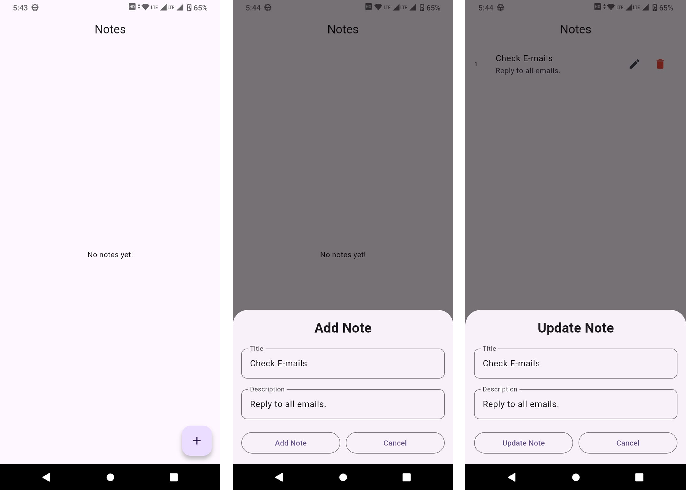

# Local Database App - Notes Manager

A Flutter application for creating and managing notes, using SQLite for local storage.

## Features

- **Create Notes**: Add new notes with a title and description.
- **Read Notes**: View a list of all saved notes.
- **Update Notes**: Edit existing notes.
- **Delete Notes**: Remove notes from the database.
- **Local Storage**: All data is persisted locally using `sqflite`.

## Tech Stack

- **Framework**: Flutter
- **Language**: Dart
- **Database**: SQLite (via `sqflite` package)
- **State Management**: `setState` (Local state interactions)

## Screenshots

## Getting Started

1.  Clone the repository.
2.  Run `flutter pub get` to install dependencies.
3.  Run `flutter run` to start the application on your emulator or device.

## Dependencies

- `flutter`
- `sqflite`
- `path`
- `path_provider`